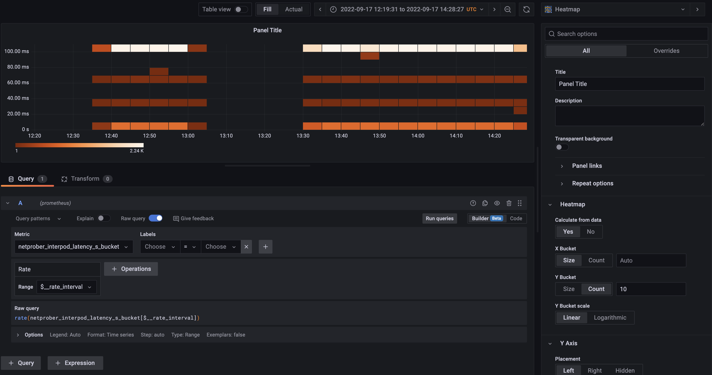

# k8s-network-prober-operator

**Project status**: alpha. This operator and its respective application ([k8s-network-prober](https://github.com/bigmikes/k8s-network-prober)) are still under active development. Main functionality of inter-Pod latency measurement is implemented, but internal design and object API might change.

## Description
The K8s Network Prober Operator provides native API objects to manage the [k8s-network-prober](https://github.com/bigmikes/k8s-network-prober) application. The purpose of this operator is to:

* Inject the `k8s-network-prober` sidecar in every Pod that matches the configured selector via a [mutating webhook](https://kubernetes.io/docs/reference/access-authn-authz/extensible-admission-controllers/)
* Configure the sidecar container.

The agent exports Prometheus metrics about the inter-Pod latency (RTT to be more precise). See the [Prometheus section](#install-prometheus) to install end configure Prometheus server.

## Custom Resource Definitions (CRDs)
This operator installs only one [CRD](https://kubernetes.io/docs/tasks/extend-kubernetes/custom-resources/custom-resource-definitions/), called `NetworkProber`, which current implementation offers the following specification properties:

* `PodSelector`: label selector that specifies the set of Pods where the agent container is injected.
* `HttpPort`: the TCP port the agent uses to exchange probe requests.
* `PollingPeriod`: the time period between two consecutive probe requests.
* `HttpPrometheusPort`: the TCP port the agent uses to export Prometheus metrics.
* `AgentImage`: the container image of the agent.

### Example

Here is an example of the `NetworkProber` object. This will inject the agent in every Pod having the label `app=net-prober`.

```yaml
apiVersion: probes.bigmikes.io/v1alpha1
kind: NetworkProber
metadata:
  name: networkprober-sample
spec:
  podSelector:
    matchLabels:
      app: net-prober
  httpPort: "9090"
  pollingPeriod: "10s"
  httpPrometheusPort: "1222"
  agentImage: "bigmikes/kube-net-prober:test-version-v8"
```

## Getting Started
You’ll need a Kubernetes cluster to run against. You can use [KIND](https://sigs.k8s.io/kind) to get a local cluster for testing, or run against a remote cluster.
**Note:** Your controller will automatically use the current context in your kubeconfig file (i.e. whatever cluster `kubectl cluster-info` shows).

### Running on the cluster
1. Install Instances of Custom Resources:

```sh
kubectl apply -f config/samples/
```

2. Build and push your image to the location specified by `IMG`:
	
```sh
make docker-build docker-push IMG=<some-registry>/k8s-network-prober-operator:tag
```
	
3. Deploy the controller to the cluster with the image specified by `IMG`:

```sh
make deploy IMG=<some-registry>/k8s-network-prober-operator:tag
```

### Uninstall CRDs
To delete the CRDs from the cluster:

```sh
make uninstall
```

### Undeploy controller
UnDeploy the controller to the cluster:

```sh
make undeploy
```

## Install Prometheus and Grafana

Prometheus and Grafana stack can be install with [its own operator](https://prometheus-operator.dev/docs/prologue/quick-start/). In short, follow these instructions:

1. Install Prometheus Operator and CRDs

```bash
git clone https://github.com/prometheus-operator/kube-prometheus.git
kubectl create -f manifests/setup
kubectl create -f manifests/
```

2. Modify the _k8s-operator_ `ClusterRole` to have permissions to access Pods

```bash
kubectl edit ClusterRole prometheus-k8s
```

Then add the Pod read permissions:

```yaml
rules:
- apiGroups:
  - ""
  resources:
  - pods
  verbs:
  - get
  - list
  - watch
```

3. Create a `PodMonitor` object with a label selector that matches the Pods, with metrics endopoint port called `np-prometheus`.

```yaml
apiVersion: monitoring.coreos.com/v1
kind: PodMonitor
metadata:
  name: example-app
spec:
  selector:
    matchLabels:
      app: net-prober
  podMetricsEndpoints:
  - port: np-prometheus
  namespaceSelector:
    any: true
```

4. Open Grafana and check the `netprober_interpod_latency_s_bucket` historgram metric.

```bash
kubectl --namespace monitoring port-forward svc/grafana 3000
```



## Contributing
This is my very first Kubernetes Operator, so any feedback is welcome. Feel free to open PRs or issues to this repo.

### How it works
This project aims to follow the Kubernetes [Operator pattern](https://kubernetes.io/docs/concepts/extend-kubernetes/operator/)

It uses [Controllers](https://kubernetes.io/docs/concepts/architecture/controller/) 
which provides a reconcile function responsible for synchronizing resources untile the desired state is reached on the cluster 

### Test It Out
1. Install the CRDs into the cluster:

```sh
make install
```

2. Run your controller (this will run in the foreground, so switch to a new terminal if you want to leave it running):

```sh
make run
```

**NOTE:** You can also run this in one step by running: `make install run`

### Modifying the API definitions
If you are editing the API definitions, generate the manifests such as CRs or CRDs using:

```sh
make manifests
```

**NOTE:** Run `make --help` for more information on all potential `make` targets

More information can be found via the [Kubebuilder Documentation](https://book.kubebuilder.io/introduction.html)

## License

Copyright 2022.

Licensed under the Apache License, Version 2.0 (the "License");
you may not use this file except in compliance with the License.
You may obtain a copy of the License at

    http://www.apache.org/licenses/LICENSE-2.0

Unless required by applicable law or agreed to in writing, software
distributed under the License is distributed on an "AS IS" BASIS,
WITHOUT WARRANTIES OR CONDITIONS OF ANY KIND, either express or implied.
See the License for the specific language governing permissions and
limitations under the License.

